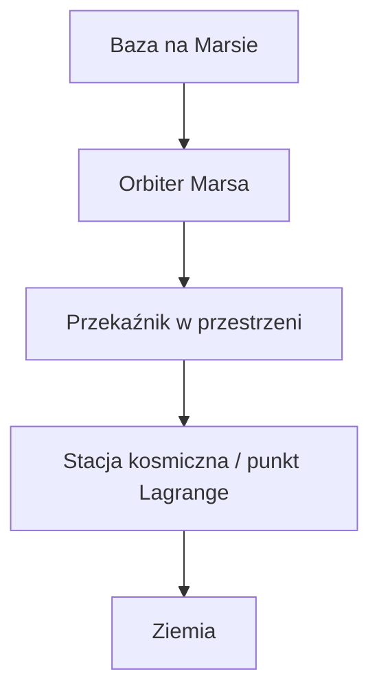

# Schemat łączności: Mars → Ziemia

Proponowany łańcuch transmisji sygnału:

```text
baza na Marsie
      ↓
orbiter Marsa
      ↓
przekaźnik w przestrzeni
      ↓
stacja kosmiczna / punkt Lagrange
      ↓
Ziemia
```

Wersja diagramu:


